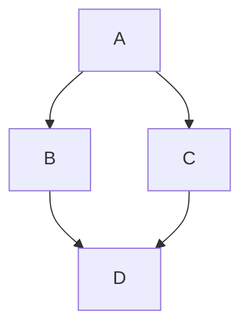

# Typescript2mermaid Suede

This repo is a [suede dependency](https://github.com/pmalacho-mit/suede).

To see the installable source code, please checkout the [release branch](https://github.com/pmalacho-mit/typescript2mermaid-suede/tree/release).

## Installation

```bash
bash <(curl https://suede.sh/install/release) --repo pmalacho-mit/typescript2mermaid-suede
```

<details>
<summary>
See alternative to using <a href="https://github.com/pmalacho-mit/suede#suedesh">suede.sh</a> script proxy
</summary>

```bash
bash <(curl https://raw.githubusercontent.com/pmalacho-mit/suede/refs/heads/main/scripts/install/release.sh) --repo pmalacho-mit/typescript2mermaid-suede
```

</details>

Author GitHub-compatible [Mermaid](https://mermaid.js.org) diagrams as **TypeScript types**, then generate them with the TypeScript compiler.

```ts
import type { Flowchart } from "typescript2mermaid";

type A = {};
type B = {};
type C = {};
type D = {};

export type Example = Flowchart.Diagram<
  "topdown",
  [
    Flowchart.Connect<A, B>,
    Flowchart.Connect<A, C>,
    Flowchart.Connect<B, D>,
    Flowchart.Connect<C, D>,
  ]
>;
```

```bash
$ ./release/cli.sh example.ts
```

````
### Example


````

Because the generator runs the real TypeScript type checker (via [ts-morph](https://ts-morph.com)), diagrams are **type-checked** — referencing an undefined node is a compile error, renames propagate through your editor — and node types are **fully resolved** into the output, so diagrams stand alone:

```ts
type A = { id: string };
type B = { name: string };
type C = A & B;

export type Resolved = Flowchart.Diagram<"leftright", C>;
```

```
flowchart LR
    C["C<br/>id: string<br/>name: string"]
```

The intersection is flattened by the checker; the node carries its complete shape. What "fully resolved" means adapts per diagram: flowchart nodes render their members inline in the label, class diagrams expand types into complete `class` bodies (including members inherited through intersections), and ER entities emit full attribute lists with key markers.

## Usage

The CLI runs straight from source with `tsx` — there is no build step and no installed binary:

```bash
./release/cli.sh <files...> [--out output.md] [--project tsconfig.json]
npx tsx release/cli.ts <files...>                # the same, without the wrapper
npm run gen -- <files...>                        # the same, via the package script
```

(`node` alone will not run it: the sources use `.js` import specifiers, which its type stripping does not remap to `.ts`. Compile with `npx tsc` first and run `dist/cli.js` if you want plain `node`.)

Every **exported** type alias whose type is a `<Family>.Diagram<...>` is emitted as a `### X` heading plus a fenced ` ```mermaid ` block. (Non-exported diagram aliases are treated as helpers — e.g. a body shared across several themed variants.) Without `--out`, markdown goes to stdout. There is also a programmatic API via `renderFrom`.

`--embed <file>` instead populates markers already present in a Markdown file, replacing what it wrote last time:

```bash
./release/cli.sh examples/*/*.ts --embed README.md
./release/cli.sh examples/*/*.ts --embed README.md --check   # CI: exit 1 if stale
```

```md
<!-- diagram: DeploymentPipeline -->
<!-- /diagram -->
```

Shorthands exist for every flag (`-o`, `-p`, `-e`, `-c`, `-m`, `-h`); see `./release/cli.sh --help`.

## Supported diagrams

All eight diagram families from the GitHub-supported Mermaid set. Each family lives in its own namespace whose `Diagram` type is the root, and whose `Statement` union constrains what its body accepts — **the type constraints are the documentation**: an invalid statement, direction, cardinality, or score is a compile error. See `examples/` for a DSL rendition of every example in [this Mermaid fundamentals tutorial](https://gist.github.com/GingerGraham/66a1e586fe2addbc6375b1fba1d2818c); all generated output parses cleanly against the Mermaid parser (`node validate.mjs examples/output.md`).

Each family's `Diagram` takes an optional final `Render.Options<...>` type argument:

```ts
Flowchart.Diagram<"topdown", [...], Render.Options<[Render.Theme<"dark">]>>
```

`Render.Theme` emits an `%%{init}%%` directive (`default`, `dark`, `forest`, `neutral`). The `Options<...>` wrapper is a marker the generator locates by key, so it works regardless of how many arguments a family's `Diagram` takes. Reuse one body across themed variants by naming it and passing different options:

```ts
import type { Flowchart, Render } from "typescript2mermaid";

type Body = [Flowchart.Connect<A, B>];
export type Light = Flowchart.Diagram<"topdown", Body>;
export type Dark = Flowchart.Diagram<"topdown", Body, Render.Options<[Render.Theme<"dark">]>>;
```

### Flowchart

```ts
Flowchart.Diagram<Direction, Body extends AnyNode | readonly Flowchart.Statement[], Options<...>?>
```

`Flowchart.Direction`: `"topdown" | "bottomup" | "leftright" | "rightleft"`. Body is a single node type or a tuple of statements:

| Statement                                                                            | Renders                                                                                                                                                               |
| ------------------------------------------------------------------------------------ | --------------------------------------------------------------------------------------------------------------------------------------------------------------------- |
| `Flowchart.Connect<A, B>`                                                            | `A --> B`                                                                                                                                                             |
| `Flowchart.Connect<A, B, "Yes">`                                                     | `A -->\|Yes\| B`                                                                                                                                                      |
| `Flowchart.Connect<A, B, never, "dotted">`                                           | `A -.-> B` (`Flowchart.EdgeStyle`: `arrow`, `line`, `dotted`, `thick`, `circle`, `cross`)                                                                             |
| `Flowchart.Node<A, "diamond">`                                                       | `A{...}` (`Flowchart.Shape`: `rectangle`, `rounded`, `stadium`, `subroutine`, `database`, `circle`, `diamond`, `hexagon`, `parallelogram`, `parallelogram-alternate`) |
| `Flowchart.Node<A, "rectangle", "Custom label">`                                     | custom label, suppresses type expansion                                                                                                                               |
| `Flowchart.Node<A, "rectangle", false>`                                              | bare name, suppresses type expansion                                                                                                                                  |
| `Flowchart.Subgraph<"Title", [A, Flowchart.Connect<A, B>]>`                          | `subgraph` block (members may be nodes or nested statements)                                                                                                          |
| `Flowchart.Style<A, "fill:#f9f">`                                                    | `style A fill:#f9f`                                                                                                                                                   |
| `Flowchart.DefineClass<"name", "fill:...">` / `Flowchart.ApplyClass<[A, B], "name">` | `classDef` / `class A,B name`                                                                                                                                         |

Node labels: if a node's resolved type has members and no explicit label, the label is `Name<br/>member: type<br/>...` (GitHub renders `<br/>` inside quoted labels).

### Sequence

```ts
Sequence.Diagram<[
  Sequence.Participant<User, "User">,                  // or Sequence.Actor<...>
  Sequence.Message<User, API, "Login", "activate">,    // ->> (opens activation box on target)
  Sequence.Reply<API, User, "OK", "deactivate">,       // -->> (closes source's activation box)
  Sequence.Lost<User, API, "oops">,                    // -x
  Sequence.Async<User, API, "fire and forget">,        // -)
  Sequence.NoteOver<[User, API], "Auth flow">,         // also NoteRight<T, "...">, NoteLeft
  Sequence.Loop<"Every 30s", [...]>,                   // also Optional<...>, Alternative<label, body, elseLabel, elseBody>
]>
```

Loop/Optional/Alternative bodies are themselves `readonly Sequence.Statement[]`, so nesting stays fully checked.

### Class diagram

```ts
type Animal = { name: string; makeSound(): void };
type Dog = Animal & { bark(): void };

Class.Diagram<
  [
    Class.Extends<Dog, Animal>, // Animal <|-- Dog
    Class.Composition<Whole, Part>, // *--   Aggregation<...> o--
    Class.Association<Owner, Animal, "owns">, // -->   Link<...> --
    Class.DependsOn<A, B>, // ..>   Realizes ..|>   Implements --|>
    Class.Class<Orphan>, // include a class with no relations
  ]
>;
```

Every referenced type expands into a full `class` body from its _resolved_ type — `Dog` lists `name`, `makeSound()`, and `bark()`. Function-typed members render as methods with parameters and return types. Visibility uses identity marker types on members: `Class.Private<T>` (`-`), `Class.Protected<T>` (`#`), `Class.Internal<T>` (`~`); default is `+`.

### State diagram

```ts
State.Diagram<[
  State.Transition<State.Start, Idle>,      // [*] --> Idle
  State.Transition<Idle, Processing, "start">,
  State.Transition<Success, State.End>,     // Success --> [*]
  State.Composite<Active, [State.Transition<State.Start, Running>, ...]>,
  State.Note<Locked, "right", "Locked after 3 attempts">,
]>
```

`State.Start` and `State.End` are pseudo-state markers rendering as `[*]`.

### Entity relationship diagram

```ts
type USER = {
  user_id: Entity.Key.Primary<Entity.Integer>;
  username: Entity.Key.Unique<Entity.Text>;
  created_at: Entity.DateTime;
};

Entity.Diagram<
  [
    Entity.Relation<USER, ORDER, "one-to-zero-or-many", "places">,
    Entity.Include<STANDALONE>,
  ]
>;
```

`Entity.Cardinality`: `one-to-one` (`||--||`), `one-to-many` (`||--|{`), `one-to-zero-or-many` (`||--o{`), `zero-or-one-to-many` (`|o--|{`), `many-to-one` (`}|--||`), `many-to-many` (`}|--|{`). Attributes come from the resolved entity type; `Entity.Key.Primary`/`Entity.Key.Foreign`/`Entity.Key.Unique` are identity markers detected on each property, rendered as `PK`/`FK`/`UK`. SQL-ish aliases `Entity.Integer`, `Entity.Decimal`, `Entity.Text`, `Entity.DateTime`, `Entity.Boolean` render as `int`, `decimal`, `text`, `datetime`, `boolean` (plain `string`/`number`/`boolean`/`Date` also map sensibly).

### Journey, Pie, Gantt

```ts
Journey.Diagram<
  "Title",
  [
    Journey.Section<
      "Discovery",
      [
        Journey.Task<"Visit homepage", 5, [User, "QA Engineer"]>, // scores: Journey.Satisfaction = 1-5
      ]
    >,
  ]
>;

Pie.Diagram<"Costs", [Pie.Slice<"EC2", 45>, Pie.Slice<"RDS", 25>]>;
// or derive slices from a type's numeric-literal properties:
type Costs = { "EC2 Instances": 45; "RDS Database": 25 };
Pie.Diagram<"Costs", Costs>;

Gantt.Diagram<
  "Title",
  "YYYY-MM-DD",
  [
    Gantt.Section<
      "Planning",
      [
        Gantt.Task<"Requirements", "req", "2024-01-01", "2024-01-15", "done">,
        Gantt.Task<"Design", "design", Gantt.After<"req">, "10d">, // Gantt.Status: done | active | crit
      ]
    >,
  ]
>;
```

Journey task actors may be type references or string literals (for names with spaces). Namespace imports may be aliased (`import type { Flowchart as F }`); the generator resolves the alias through the symbol table.

## VSCode integration

The `vscode-extension/` directory contains a companion extension: hovering a `<Family>.Diagram<...>` alias shows the generated Mermaid source inline, with a code lens / hover link that opens the fully rendered diagram in a side panel (Mermaid bundled locally, theme-aware, pan/zoom).

An open preview **updates live**. Because a diagram's nodes are usually types declared in other modules, it watches the previewed file *plus its transitive imports* — editing a type two files away re-renders the panel, and adding an import expands what's watched. Updates are pushed into the existing webview, so your pan/zoom survives; half-typed code keeps the last good diagram on screen instead of flashing errors.

See `vscode-extension/README.md` for build-and-run steps. The extension is a thin client over `GeneratorSession` — a long-lived project that accepts unsaved buffer text and reports its dependency graph — which other editor integrations can reuse.

## How it works

The generator never executes your code. It loads files into a ts-morph `Project`, finds type aliases whose type node is a `Diagram<...>` reference, and walks the type-argument _syntax_ to read the DSL structure (string/number literals, tuples, references). Wherever a user type is referenced as a node/class/entity, it asks the type checker for the fully resolved type behind it and flattens its members. Markers like `Private<T>` and `PK<T>` are declared as identity types (`type PK<T> = T`) so the checker sees clean types, while the generator recovers the markers syntactically from each property's original declaration — which is why they survive through intersections and other type-level composition.

## Limitations

- Node identity is the referenced type's name; two types with the same name from different scopes collide.
- Deeply generic or recursive member types render as their declared text, which can produce labels Mermaid dislikes (e.g. `|` in unions inside class bodies). Use `Node<T, shape, "label">` or simpler facade types where needed.
- Mermaid feature support varies by renderer version; everything here targets what GitHub renders as of 2026.
