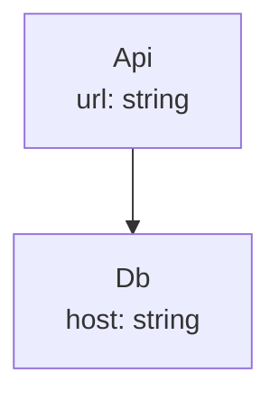
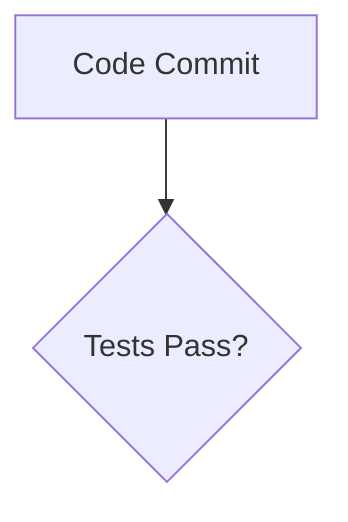

> [!NOTE]
> This is a [suede](https://github.com/pmalacho-mit/suede) dependency. 
---

# Quick reference

Author Mermaid diagrams as **TypeScript types**. The generator reads the type *syntax* (via ts-morph) and uses the real type checker to fully resolve any referenced type into the output — so diagrams are type-checked, renames propagate, and node types render their actual shape.

**The one rule:** every **exported** type alias whose type is a `<Family>.Diagram<...>` is emitted. Unexported aliases are helpers (e.g. a body shared across variants).

```ts
import type { Flowchart, Render } from "typescript2mermaid";

type Api = { url: string };
type Db = { host: string };

export type Overview = Flowchart.Diagram<"topdown", [Flowchart.Connect<Api, Db>]>;
```



**Resolution is the point.** A referenced type expands into the output: flowchart labels list members, class diagrams become full `class` bodies, ER entities become attribute lists — all surviving intersections (`A & B`) and aliases.

**Options** are each Diagram's optional final type argument. Themes: `default | dark | forest | neutral`.

```ts
type Body = [Flowchart.Connect<Api, Db>];
export type Light = Flowchart.Diagram<"topdown", Body>;
export type Dark  = Flowchart.Diagram<"topdown", Body, Render.Options<[Render.Theme<"dark">]>>;
```

## Families

| `Diagram<...>` signature | Statements |
| --- | --- |
| `Flowchart.Diagram<Dir, Body, Opts?>`<br/>`Dir`: `topdown\|bottomup\|leftright\|rightleft`<br/>`Body`: one node type **or** a statement tuple | `Connect<A,B,Label?,Edge?>` · `Node<T,Shape?,Label?>` · `Subgraph<"Title",[...]>` · `Style<T,Css>` · `DefineClass<Name,Css>` · `ApplyClass<[A,B],Name>`<br/>`Edge`: `arrow\|line\|dotted\|thick\|circle\|cross` · `Shape`: `rectangle\|rounded\|stadium\|subroutine\|database\|circle\|diamond\|hexagon\|parallelogram\|parallelogram-alternate`<br/>`Node` label: omit → expand type, `"text"` → custom, `false` → bare name |
| `Sequence.Diagram<Body, Opts?>` | `Participant<T,Alias?>` · `Actor<T,Alias?>` · `Message<A,B,Text,Act?>` (`->>`) · `Reply<...>` (`-->>`) · `Lost<A,B,Text>` (`-x`) · `Async<A,B,Text>` (`-)`) · `NoteOver<[A,B],Text>` · `NoteRight<T,Text>` · `NoteLeft<T,Text>` · `Loop<Label,[...]>` · `Optional<Label,[...]>` · `Alternative<Label,[...],ElseLabel?,[...]?>`<br/>`Act`: `activate\|deactivate` (opens/closes an activation box) |
| `Class.Diagram<Body, Opts?>` | `Class<T>` · `Extends<Child,Parent>` · `Composition<W,P,L?>` · `Aggregation<W,P,L?>` · `Association<A,B,L?>` · `Link<A,B,L?>` · `DependsOn<A,B,L?>` · `Realizes<A,B>` · `Implements<A,B>`<br/>Member visibility markers: `Class.Private<T>` `-`, `Class.Protected<T>` `#`, `Class.Internal<T>` `~`, default `+` |
| `State.Diagram<Body, Opts?>` | `Transition<From,To,Label?>` · `Composite<T,[...]>` · `Note<T,"right"\|"left",Text>`<br/>`State.Start` / `State.End` render as `[*]` |
| `Entity.Diagram<Body, Opts?>` | `Relation<A,B,Cardinality,Label>` · `Include<T>`<br/>`Cardinality`: `one-to-one\|one-to-many\|one-to-zero-or-many\|zero-or-one-to-many\|many-to-one\|many-to-many`<br/>Attribute markers: `Entity.Key.Primary/Foreign/Unique<T>` → `PK`/`FK`/`UK`; types `Entity.Integer\|Decimal\|Text\|DateTime\|Boolean` |
| `Journey.Diagram<Title, Body, Opts?>` | `Section<Name,[Task...]>` · `Task<Desc, Score, Actors>`<br/>`Score`: `1`–`5` · actors are type refs or string literals |
| `Pie.Diagram<Title, Body, Opts?>` | `Slice<Label,Value>` tuple — **or** pass a type whose numeric-literal props become slices: `{ CPU: 35; Memory: 25 }` |
| `Gantt.Diagram<Title, DateFormat, Body, Opts?>` | `Section<Name,[Task...]>` · `Task<Desc,Id,Begin,Finish,Status?>`<br/>`Begin` may be `Gantt.After<"otherId">` · `Status`: `done\|active\|crit` |

Nested bodies keep their own `Statement` union, so invalid nesting is a compile error.

## Generating

`cli.sh` runs `cli.ts` through `tsx` — no build step and no installed binary. It
resolves `cli.ts` relative to itself, so it works from any working directory;
call it by whatever path this folder sits at.

```bash
./cli.sh <files...>                                  # ```mermaid blocks to stdout
./cli.sh <files...> --out out.md                     # standalone report
./cli.sh <files...> --embed README.md                # embed in place (repeatable)
./cli.sh <files...> --embed README.md --check        # CI: exit 1 if out of date
./cli.sh --embed docs/api.md                         # sources default to docs/diagram.ts
```

Equivalently, without the wrapper: `npx tsx cli.ts <files...>`.

**Sources are optional when embedding.** With no files given, each `--embed`
target's own folder is searched for a `diagram.ts` — so a document and the
diagrams it shows can sit side by side and `./cli.sh --embed docs/api.md` is the
whole command. Several documents in one folder share that one source file. A
folder without a `diagram.ts` is skipped rather than fatal; its markers report
themselves as unresolved.

Because a marker resolves to the *nearest* matching source (see below), every
folder can export a diagram under the same name:

```bash
./cli.sh --embed a/README.md --embed b/README.md   # each gets its own a|b/diagram.ts
```

| flag | shorthand | |
| --- | --- | --- |
| `--project <path>` | `-p` | tsconfig.json to resolve sources against |
| `--embed <file>` | `-e` | Markdown file to populate in place. Repeatable |
| `--out <path>` | `-o` | Write a standalone Markdown report |
| `--check` / `--no-check` | `-c` | Write nothing; exit non-zero if anything is stale |
| `--marker <word>` | `-m` | Marker keyword (default `diagram`) |
| `--help` | `-h` | Show generated usage |

`node` alone will not run `cli.ts`: the sources use `.js` import specifiers, which
its type stripping does not remap to `.ts`. If you want plain `node`, compile
first (`npx tsc`) and run the emitted `dist/cli.js`.

## Embedding into Markdown

Mark the spot with an HTML comment — invisible once rendered — naming the diagram:

```md
## Deployment

<!-- diagram: DeploymentPipeline -->
```

Run `./cli.sh examples/**/*.ts --embed README.md` and the region is filled in:

````md
<!-- diagram: DeploymentPipeline -->

<!-- /diagram -->
````

You only ever write the opening line. The closing marker is inserted on the first
run, and is what makes every later run replace rather than append — so the
command is idempotent and safe in a pre-commit hook or CI.

- **Names** match the alias (`DeploymentPipeline`) or its namespace-qualified id
  (`Docs.DeploymentPipeline`).
- **The nearest source wins** when several export the same name, measured in
  directory steps from the document: same folder, then a subfolder, then a
  parent, then further afield. So every folder is free to export a plain
  `Diagram`, and `./cli.sh --embed a/README.md --embed b/README.md` gives each
  document its own. Proximity only breaks ties — two *equally* near sources are
  still reported rather than silently guessed. Force a choice with
  `<!-- diagram: Shared from="src/b.ts" -->`, which is applied before proximity.
- **Nothing else is touched.** Prose outside the markers, markers *documented
  inside* a fenced code block, and hand-written text under a marker that has no
  closing tag are all left alone.
- **A name that stops resolving is reported, not deleted** — a renamed
  declaration fails the run instead of silently wiping your docs.

```ts
import { renderFrom } from "typescript2mermaid";

renderFrom.files(["diagrams.ts"]);   // → { name, file, code }[]
renderFrom.code("export type D = ...");
renderFrom.source(sourceFile);       // existing ts-morph SourceFile
```

For editors, `GeneratorSession` keeps a project alive across calls: `updateFile(path, text)` pushes unsaved buffers, `generate(path)` re-emits, and `dependencies(path)` returns the file plus its transitive imports (what to watch for live previews).

Under the hood this package is a thin Mermaid layer over a generic TypeScript-DSL harness (`typescript-dsl-suede/`): `render.ts` maps each construct — `"Flowchart.Diagram"`, `"Sequence.Diagram"`, … — to the family module that renders it, and exports `analyzer` / `dsl` for embedding elsewhere.
